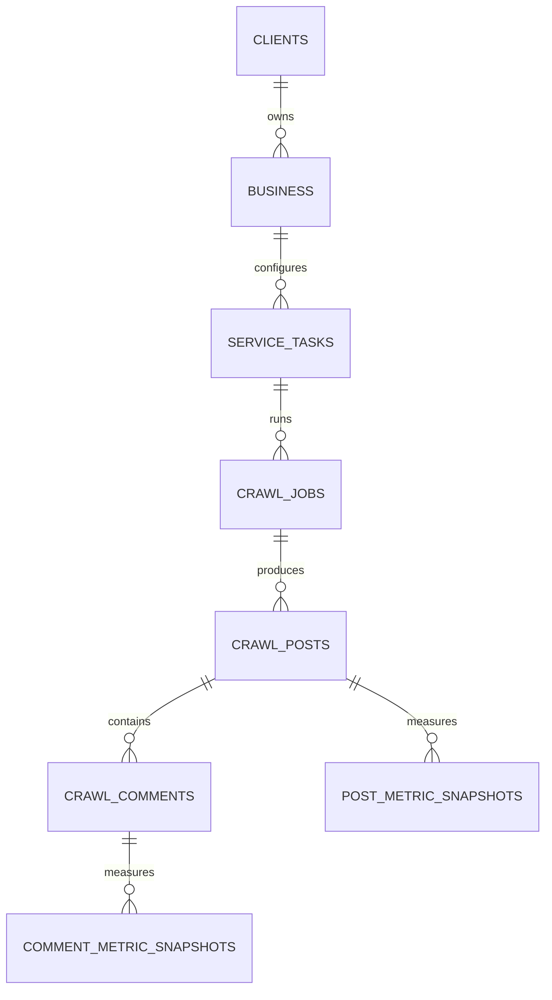

# Minimal Latest-State Crawl Schema

Only `crawl_posts` stores `crawl_job_id`. Comments and metrics resolve business context through their parent. No observation/event table and no context view is part of the runtime schema.

Metric history retains `collected_at`, not job lineage. This keeps the data model consistent with the latest-state decision.
