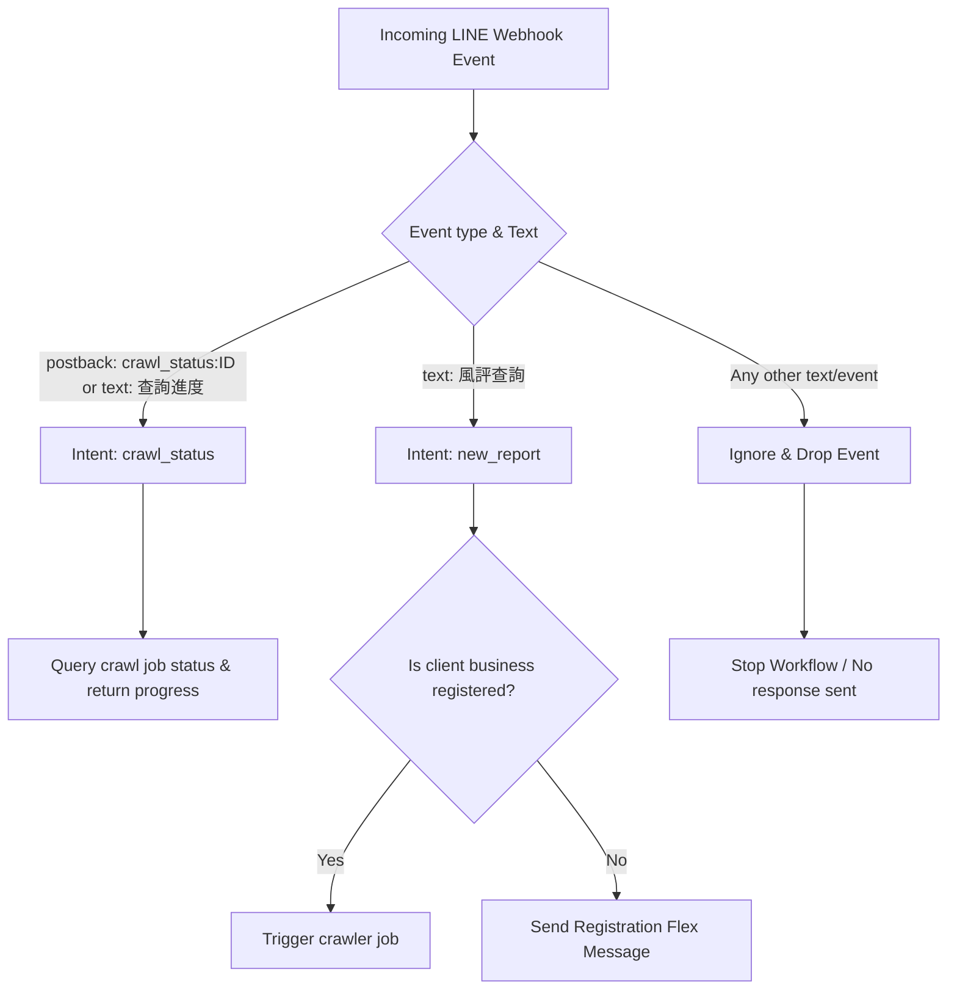

# LINE Rich Menu Configuration & Integration Guide

This guide explains how to add and configure the **LINE Rich Menu** for BI-RMP. The Rich Menu provides a persistent, interactive footer in the user's LINE chat window. 

According to product rules:
- **Registration (立即註冊)** is kept in the original onboarding flow (e.g. registration triggers on first join) and is **NOT** placed inside the persistent Rich Menu.
- The Rich Menu contains exactly **three buttons** configured horizontally:
  1. **風評查詢 (Reputation Query)**: Sends message `"風評查詢"` to trigger the reputation crawler.
  2. **輿情中心 (Sentiment Center)**: Opens a link/URL to redirect users to the Sentiment Center dashboard.
  3. **功能規劃中 (Coming Soon)**: A placeholder button for future functionality.

A custom asset [line_rich_menu.jpg](file:///c:/Users/zifue/Documents/AgenticAI/BI-RMP/docs/design/line_rich_menu.jpg) (2500x843 pixels, compressed JPEG) has been generated and saved under the design folder.

---

## Method A: Visual Setup via LINE Official Account Manager (No-Code)

This is the easiest way to manually set up the Rich Menu in the LINE console:

1. **Log in to the Console**: Go to the [LINE Official Account Manager](https://manager.line.me/) and select your account.
2. **Create a Rich Menu**:
   - Navigate to **Chat tools (聊天室工具)** -> **Rich menus (圖文選單)**.
   - Click **Create new (建立)**.
3. **Configure Settings**:
   - Set a title (e.g., `BI-RMP Main Menu`).
   - Set the chat bar text (e.g., `開啟選單`).
   - Select default display behavior (Show).
4. **Upload Design Image**:
   - Under **Content settings**, click **Select Template**.
   - Choose the **Compact template with 3 vertical columns** (size 2500x843).
   - Click **Design image** -> **Upload image** and choose the generated [line_rich_menu.jpg](file:///c:/Users/zifue/Documents/AgenticAI/BI-RMP/docs/design/line_rich_menu.jpg).
5. **Configure Actions**:
   Define the actions for the 3 columns:
   - **Area A (Left, x: 0, y: 0, w: 833, h: 843)**:
     - Type: `Text`
     - Text: `風評查詢`
     - Label: `風評查詢`
   - **Area B (Middle, x: 833, y: 0, w: 834, h: 843)**:
     - Type: `Link`
     - URL: `https://your-dashboard-domain.com/dashboard` (Your Sentiment Dashboard URL)
     - Label: `輿情中心`
   - **Area C (Right, x: 1667, y: 0, w: 833, h: 843)**:
     - Type: `Text`
     - Text: `功能規劃中`
     - Label: `功能規劃中`
6. **Save**: Click **Save** to publish the menu.

---

## Method B: Programmatic Setup via Python Script

To automate or update the registration programmatically, use the utility script [manage_rich_menu.py](file:///c:/Users/zifue/Documents/AgenticAI/BI-RMP/Backend/scripts/manage_rich_menu.py).

### Prerequisites
1. Set the URL of your dashboard in `.env`:
   ```ini
   BI_RMP_DASHBOARD_URL=https://your-dashboard-domain.com/dashboard
   ```
2. Verify that `LINE_CHANNEL_ACCESS_TOKEN` is set.

### CLI Commands

* **Quick Setup (Recommended)**: Create the menu structure, upload the image, and set it default in one command:
  ```powershell
  .venv\Scripts\python Backend/scripts/manage_rich_menu.py quick-setup docs/design/line_rich_menu.jpg
  ```

* **Management Operations**:
  * List all registered Rich Menus (and see which one is default):
    ```powershell
    .venv\Scripts\python Backend/scripts/manage_rich_menu.py list
    ```
  * Delete a Rich Menu:
    ```powershell
    .venv\Scripts\python Backend/scripts/manage_rich_menu.py delete <rich_menu_id>
    ```
  * Cancel the default Rich Menu:
    ```powershell
    .venv\Scripts\python Backend/scripts/manage_rich_menu.py cancel-default
    ```

---

## Behind the Scenes: n8n Routing Logic & Message Exclusions

To prevent arbitrary text messages from triggering reputation crawls (leaving the chat window clean for human-to-human admin support), the `verify-route` Code node in [reputation-optimization-flow.json](file:///c:/Users/zifue/Documents/AgenticAI/BI-RMP/infra/n8n/workflows/reputation-optimization-flow.json) has been configured as follows:



This ensures that only tapping **風評查詢** triggers a crawler run, and only tapping **查詢進度** (or clicking progress quick replies) queries the progress. All other chat messages bypass the bot program completely.
